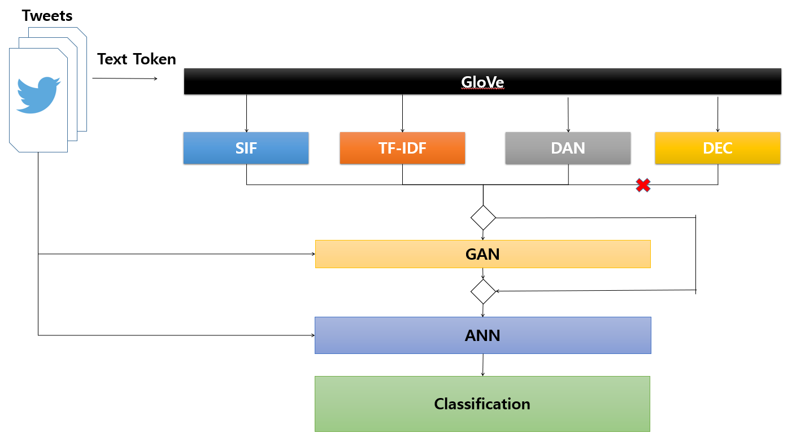

# [2021 Spring PODL Project] Twitter RecSys Challenge 2021
- **Team**: Team 4
- **Member**
  - 권영인 (YoungIn Kwon)
  - 김준형 (JoonHyung Kim)
  - 이영호 (YeongHo Lee)
## 1. Competition Overview
- **Goal**: 
  - To predict the probability of different engagement types of a target user for a set of tweets based on heterogeneous input data **while providing fair recommendations**.
- **Data** (Train: [part-00000, part-00001, part-00002, part-00003] / Test: [part-00004])
  - Tweet Features
    - Text tokens: Ordered list of Bert ids corresponding to Bert tokenization of Tweet text
    - Hashtags:Tab separated list of hastags (identifiers) present in the tweet
    - Tweetd id:Tweet identifier
    - Present media:Tab separated list of media types. Media type can be in (Photo, Video, Gif)
    - Present links:Tab separeted list of links (identifiers) included in the Tweet
    - Present domains:Tab separated list of domains included in the Tweet (twitter.com, dogs.com)
    - Tweet type:Tweet type, can be either Retweet, Quote or Toplevel
    - Language:Identifier corresponding to the inferred language of the Tweet
    - Timestamp:Unix timestamp, in sec of the creation time of the Tweet
  - Engaged With User Features
    - User id:User identifier
    - Follower count:Number of followers of the user
    - Following count:Number of accounts the user is following
    - Is verified?:Is the account verified?
    - Account creation time:Unix timestamp, in seconds, of the creation time of the account
  - Engaging User Features
    - User id:User identifier
    - Follower count:Number of followers of the user
    - Following count:Number of accounts the user is following
    - Is verified?:Is the account verified?
    - Account creation time:Unix timestamp, in seconds, of the creation time of the account
  - Engagement Features
    - Engagee follows engager?:Does the account of the engaged tweet author follow the account that has made the engagement?
    - Reply engagement timestamp:If there is at least one, unix timestamp, in s, of one of the replies
    - Retweet engagement timestamp:If there is one, unix timestamp, in s, of the retweet of the tweet by the engaging user
    - Retweet with comment engagement timestamp:If there is at least one, unix timestamp, in s, of one of the retweet with comment of the tweet by the engaging user
    - Like engagement timestamp:If there is one, Unix timestamp, in s, of the like
## 2. Models
**< Model Structure >**

**<STEP 1>** Pretrain - Text Token Embedding

- Glove
  - Input: Text Token
  - Ouput:  Embedding vector of words
- TF-IDF
  - Input: Output of GloVe
  - Ouput:  d dimension vector
- SIF
  - Input: Output of GloVe
  - Ouput:  d dimension vector
- DAN
  - Input: Output of GloVe
  - Ouput: d dimension vector
- DEC
  - Input: Output of GloVe
  - Ouput: n clustered integer
    
**<STEP 2>** Over Sampling

- GAN
  - Input: Output of TF-IDF, SIF, DAN, DEC, Features except text-token
  - Ouput: Fake inputs with Label

**<STEP 3>** Train

- ANN

  - Input: Output of GAN(perhaps), Features except text-token
  - Ouput: Classifier

**<STEP 4>**  Inference

- Input: Output of GAN(perhaps), Features except text-token
- Ouput: Classifier

## 3. Requirements

### 1) Environment
- OS: Windows 10
- CPU: i5-10600K
- GPU: GTX 1660 SUPER
- RAM: 64GB
### 2) Library
| Package             | Version  | Installation |
| ------------------- | -------- | ------------ |
| dask                | 2021.4.0 | conda        |
| glove-python-binary | 0.2.0    | pip          |
| numpy               | 1.20.1   | conda        |
| pandas              | 1.2.2    | conda        |
| pytorch             | 1.7.1    | conda        |
| scikit-learn        | 0.24.1   | conda        |
| scipy               | 1.6.1    | conda        |
| torchvision         | 0.8.2    | conda        |
| tqdm                | 4.58.0   | conda        |

## 4. File and Folder
~~~
├── imgs
├── input
│   ├──model
│   	├── glove_{window_size}_{epochs}_{learning_rate}_{n_components}.model: trained GloVe model
│   	├── dan_reply_over.pth: trained dan model for reply
│   	├── dan_retweet_over.pth:: trained dan model for retweet
│   	├── dan_retweet_c_over.pth: trained dan model for retweet_with_comment
│   	├── dan_like.pth: trained dan model for like
│   	├── t_h1_rec.pth: pretrained greedy-wise hidden layer1
│   	├── t_h2_rec.pth: pretrained greedy-wise hidden layer2
│   	├── t_h3_rec.pth: pretrained greedy-wise hidden layer3
│   	├── t_h4_rec.pth: pretrained greedy-wise hidden layer4
│   	├── t_total_rec.pth: pretrained tied whole autoencoder
│   	├── t_dec_rec.pth: trained dec model
│   	├── D.pth: trained discriminator
│   	├── G.pth: trained generator
│   	├── ANN_tfidf_not_gan.pt: trained ann without text_token and gan
│   	└── ANN_gan.pth: trained ann with text_token and gan
│   ├──data
│   	├── part-00000.lzo [train]
│       ├── part-00001.lzo [train]
│       ├── part-00002.lzo [train]
│       ├── part-00003.lzo [train]
│       └── part-00004.lzo [test]
├── output
│   └──result
│   	├── prediction_reply.csv: result for reply
│   	├── prediction_retweet.csv: result for retweet
│   	├── prediction_quote.csv: result for retweet_with_comment
│   	└── prediction_fav.csv: result for like
├── custom_dataset.py: datasets for neural network
├── data_loader.py: dataloader for reading tsv files (part-{00001-00005})
├── infernece.py: inference result using trained weight by train.py
├── models.py: neural network models used in this project
├── pretrain.py: pretraining [GloVe | DAN | DEC | GAN] for final ANN model's input
├── processor.py: process data preprocess / train / predict for all models of project
├── train.py: training target ANN model
├── utils.py: utilities(metrics and earlystopping module) for implementing code
└── [2021_Spring-PODL-Project-Final] Team4_Twitter Recommendation of Recsys 2021.pdf: presentation file
~~~

## 5. Run the code
### 1) About train case

**<STEP 1>** `$> python pretrain.py` 

  - **Inputs**

    - `epochs` : the number of epochs for training model

    - `batch_size` : the number of batch_size for training model

    - `patience`: patience of EarlyStopping for training model

    - `global_seed` : global seed for fixing training process

    - `verbose` : condition to print out training process

    - `train_ratio`: train ratio of training neural network

      ######  Train Data

    - `lzo_numbers` : lzo number list be trained

      ###### GloVe

    - `window_size`: [GloVe] window size of co-occurrence matrix for GloVe vector

    - `n_components`: [GloVe] the number of dimensionality for GloVe vector

      ###### DAN | GAN

    - `target_column` : [DAN | GAN] training target column [reply | retweet | retweet_c | like]

      ###### DEC

    - `is_tying` : [DEC] condition tying weights of autoenocoder

    - `layers` : [DEC] pass the number of dimensionality for GloVe vector

      ###### GAN

    - `token_model` : [GAN] text token model for generating fake data / label
    - `gan_ratio` : [GAN] gan generation ratio

  - **Outputs**
  
    ###### GloVe

  - `glove_{window_size}_{epochs}_{learning_rate}_{n_components}.model` : 

    ###### DAN

  - `dan_like.pth` : trained DAN about like

  - `dan_reply_over.pth` : trained DAN about reply

  - `dan_retweet_over.pth` : trained DAN about retweet

  - `dan_retweet_c_over.pth` : trained DAN about retweet with comment

    ###### DEC

  - ` t_h1_rec.pth` : trained tied autoencoder about layer 0 and 1

  - `t_h2_rec.pth` : trained tied autoencoder about layer 1 and 2

  - `t_h3_rec.pth` : trained tied autoencoder about layer 2 and 3

  - `t_h4_rec.pth` : trained tied autoencoder about layer 3 and 4

  - `t_total_rec.pth` : trained tied autoencoder about all layer

  - `t_dec_rec.pth` : trained tied autoencoder about encoder

    ###### GAN

  - `D.pth` : Discriminator Model 

  - `G.pth` : Generator Model

  - **Example**

    ###### GloVe

    python pretrain.py --model_type=GloVe --epochs=25 --learning_rate=0.05 --lzo_numbers=0,1,2,3 --window_size=10 --n_components=20 --global_seed=42 --verbose=True

    ###### DAN

    python pretrain.py --model_type=DAN --epochs=10 --batch_size=50000 --learning_rate=0.01 --lzo_numbers=0,1,2,3 --target_column=reply --patience=5 --train_ratio=0.8 --global_seed=42 --verbose=True

    ###### DEC
    
    python pretrain.py --model_type=DEC --epochs=40 --batch_size=50000 --learning_rate=0.01 --lzo_numbers=0,1,2,3 --is_tying=True --layers=20,64,64,256,16 --patience=5 --train_ratio=0.8 --global_seed=42 --verbose=True

    ###### GAN

    python pretrain.py --model_type=GAN --epochs=1000 --learning_rate=0.01 --lzo_numbers=0,1,2,3 --target_column=reply --token_model=[TFIDF|SIF|DAN] --train_ratio=0.8 --global_seed=42 --verbose=True

**<STEP 2>** `$> python train.py` 

- **Inputs**
  - `epochs` : the number of epochs for training model
  - `batch_size` : the number of batch_size for training model
  - `learning_rate` : learning rate for training model
  - `patience` : patience of EarlyStopping for training model
  - `token_model` : pass target model be pretrained [tfidf-glove | SIF | DAN]
  - `gan_ratio`:gan generation ratio
  - `lzo_numbers` : lzo number list be trained
  - `target_column`: training target column [reply | retweet | retweet_c | like]
  - `train_ratio`: train ratio of training neural network
  - `global_seed` : global seed for fixing training process
  - `verbose` : condition to print out training process
- **Outputs**
  - `ANN_tfidf_not_gan.pt` : trained ANN model without gan output
  - `ANN_gan.pth` : trained ANN model with gan

- **Example**

  python train.py --epochs=250 --batch_size=50000 --learning_rate=0.001 --patience=100 --lzo_numbers=0,1,2,3 --target_column=reply --token_model=[TFIDF | SIF | DAN] --gan_ratio=0.5 --train_ratio=0.8 --global_seed=42 --verbose=True

### 2) New test case

**<STEP 1>** `$> python inference.py`  

- **Inputs**
  - `epochs` : the number of epochs for training model
  - `batch_size` : the number of batch_size for training model
  - `learning_rate` : learning rate for training model
  - `token_model` : pass target model be pretrained [tfidf-glove | SIF | DAN]
  - `is_gan`: condition to turn on | off gan inference
  - `lzo_numbers` : lzo number list be trained
  - `target_column`: training target column [reply | retweet | retweet_c | like]
  - `train_ratio`: train ratio of training neural network
  - `global_seed` : global seed for fixing training process
  - `verbose` : condition to print out training process
- **Outputs**
  - `prediction_reply.csv`: result for reply
  - `prediction_retweet.csv`: result for retweet
  - `prediction_quote.csv`: result for retweet_with_comment
  - `prediction_fav.csv`: result for like
- **Example**

  python inference.py --batch_size=50000 --lzo_numbers=4 --target_column=reply --token_model=[TFIDF | SIF | DAN] --is_gan=True --global_seed=42 --verbose=True

